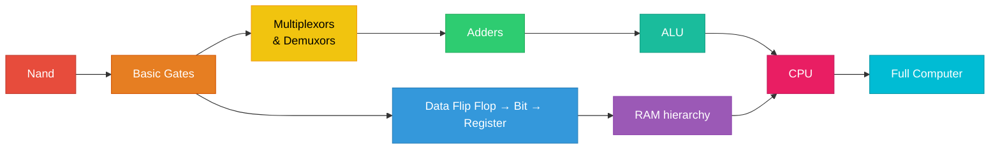
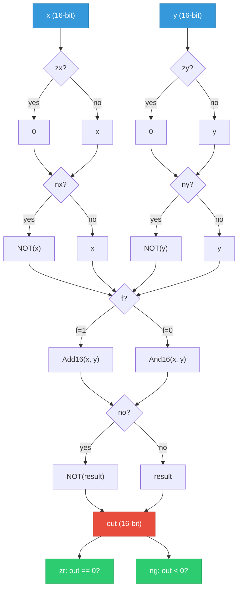
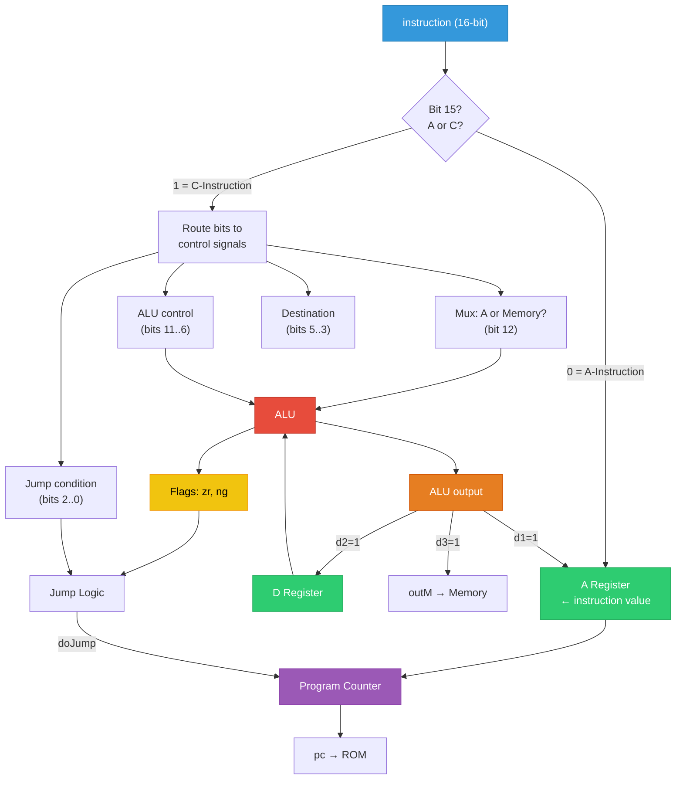
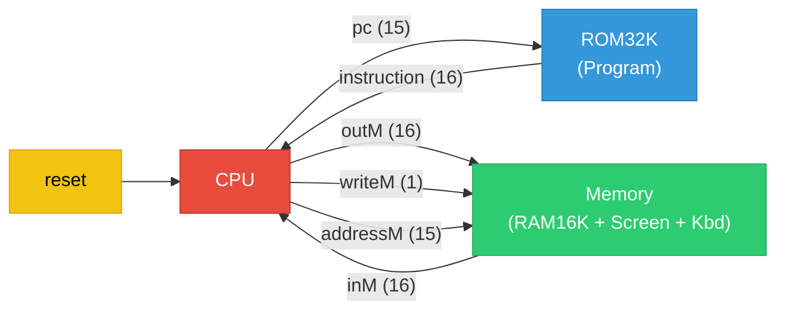
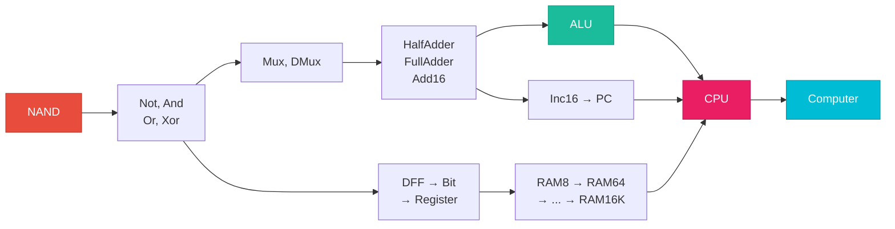

# ZAP: Computer built from Scratch

## Table of Contents

1. [What is ZAP?](#what-is-zap)
2. [Bottom Up](#bottom-up)
3. [Phase 1: Foundation Chips](#phase-1-foundation-chips)
4. [Phase 2: Instruction Set Architecture](#phase-2-instruction-set-architecture)
5. [Phase 3: The ALU](#phase-3-the-alu)
6. [Phase 4: Memory](#phase-4-memory)
7. [Phase 5: The CPU](#phase-5-the-cpu)
8. [Phase 6: The Full Computer](#phase-6-the-full-computer)
9. [Timing Model](#timing-model)
10. [Summary](#summary)

## What is ZAP?

ZAP is a **16-bit computer** built entirely from scratch, starting from a primitive logic gates.

**Specs:**
- 16-bit data width
- Harvard architecture (separate instruction and data memory)
- Single cycle execution: one instruction per clock tick
- Two instruction formats: **A-instructions** (addresses/variables) and **C-instructions** (compute)
- Two general purpose registers (A and D), an ALU, and a Program Counter
- Memory mapped I/O (screen + keyboard)

## Bottom Up

Each component is built first and then integrated into a larger one.



## Phase 1: Foundation Chips

Everything in a digital system traces back to a small set of logic gates.

### Layer 1: Basic Logic Gates

I started with `Not`, `And`, `Or`, and `Xor` all implemented using NAND only. These four gates can express any Boolean function.

I then made 16 bit bus versions: `Not16`, `And16`, `Or16`, and `Or8Way`.

### Layer 2: Multiplexors and Demultiplexors

A Mux selects between inputs based on a control signal. A DMux routes one input to one of many outputs.

| Chip |
|------|
| `Mux` |
| `Mux16` |
| `Mux4Way16` |
| `Mux8Way16` |
| `DMux` |
| `DMux4Way` |
| `DMux8Way` |

Multi way variants are built by cascading smaller ones. `Mux4Way16` is just two `Mux16` feeding into a third.

### Layer 3: Arithmetic

| Chip |
|------|
| `HalfAdder` |
| `FullAdder` |
| `Add16` |
| `Inc16` |

`Inc16` adds 1 to a 16 bit value, exactly what the Program Counter needs each cycle.


## Phase 2: Instruction Set Architecture

Two instruction formats, both 16 bits wide.

### A-Instruction

Format: `0vvvvvvvvvvvvvvv`

Bit `[15] = 0` marks it as an A-instruction. The remaining 15 bits load directly into the A register.

Used for:
- Loading constants: `@42`
- Setting memory addresses: `@8192`
- Setting jump targets: `@LOOP`

**Example:** `@12345` → `0011000000111001`

### C-Instruction

Format: `1xxa cccccc ddd jjj`

Bit `[15] = 1` marks it as a C-instruction.

| Field | Bits | Purpose |
|-------|------|---------|
| `a` | `[12]` | ALU input: 0 = A register, 1 = Memory\[A\] |
| `comp` | `[11..6]` | ALU control bits: `zx, nx, zy, ny, f, no` |
| `dest` | `[5..3]` | Write target: bit 5 → A, bit 4 → D, bit 3 → Memory |
| `jump` | `[2..0]` | Jump condition: bit 2 → negative, bit 1 → zero, bit 0 → positive |

**Example:** `D=A-D` → `1110000111010000`

### Design Decisions

**Direct wiring.** Instruction bits connect straight to hardware control lines which means no decode ROM, no microcode, no state machine. Bit `[12]` is literally the Mux select wire. Bits `[11..6]` go straight to the ALU pins.

**Orthogonality.** Destination and jump fields are independent. Any combination of write targets (A, D, Memory) and any combination of jump conditions can be expressed in a single instruction.

## Phase 3: The ALU

### The Problem

I needed the ALU to compute `x+y`, `x-y`, `x&y`, `x|y`, `0`, `1`, `-1`, `-x`, `x+1`, `x-1`, and more. Building a dedicated circuit per operation and muxing between them would be wasteful.

### 6 Control Bits

Instead, the ALU applies a fixed sequence of transformations to inputs `x` and `y`, controlled by 6 bits:

| Bit | Name | Effect |
|-----|------|--------|
| `zx` | Zero x | Replace x with 0 |
| `nx` | Negate x | Bitwise NOT x |
| `zy` | Zero y | Replace y with 0 |
| `ny` | Negate y | Bitwise NOT y |
| `f` | Function | 1 = Add, 0 = And |
| `no` | Negate output | Bitwise NOT the result |

Different combinations of these 6 bits produce **18 useful operations** from one datapath.

| zx | nx | zy | ny | f | no | Output |
|:---:|:---:|:---:|:---:|:---:|:---:|:---|
| 1 | 0 | 1 | 0 | 1 | 0 | 0 |
| 1 | 1 | 1 | 1 | 1 | 1 | 1 |
| 1 | 1 | 1 | 0 | 1 | 0 | -1 |
| 0 | 0 | 1 | 1 | 0 | 0 | x |
| 1 | 1 | 0 | 0 | 0 | 0 | y |
| 0 | 0 | 1 | 1 | 0 | 1 | NOT x |
| 1 | 1 | 0 | 0 | 0 | 1 | NOT y |
| 0 | 0 | 1 | 1 | 1 | 1 | -x |
| 1 | 1 | 0 | 0 | 1 | 1 | -y |
| 0 | 1 | 1 | 1 | 1 | 1 | x+1 |
| 1 | 1 | 0 | 1 | 1 | 1 | y+1 |
| 0 | 0 | 1 | 1 | 1 | 0 | x-1 |
| 1 | 1 | 0 | 0 | 1 | 0 | y-1 |
| 0 | 0 | 0 | 0 | 1 | 0 | x+y |
| 0 | 1 | 0 | 0 | 1 | 1 | x-y |
| 0 | 0 | 0 | 1 | 1 | 1 | y-x |
| 0 | 0 | 0 | 0 | 0 | 0 | x AND y |
| 0 | 1 | 0 | 1 | 0 | 1 | x OR y |

### ALU Internal Flow



### Status Flags

Two flags come out alongside the result:

- **`zr`**: 1 if output is zero. Computed by OR-ing all 16 output bits (`Or8Way` twice) then NOT-ing.
- **`ng`**: 1 if output is negative. In two's complement that's just `out[15]`.

These drive the jump logic in the CPU.


## Phase 4: Memory

### Building Blocks

| Chip | Notes |
|------|-------|
| `DFF` | Hardware primitive, this chip stores state across time |
| `Bit` | Mux + DFF: loads new value when `load=1`, otherwise holds current |
| `Register` | 16 × Bit in parallel |

The `Bit` chip design is worth noting: a Mux sits in front of the DFF, controlled by `load`. This means the register only updates when explicitly told to.

### RAM Hierarchy

| Chip | Size |
|------|------|
| `RAM8` | 8 registers |
| `RAM64` | 64 registers |
| `RAM512` | 512 registers |
| `RAM4K` | 4096 registers |
| `RAM16K` | 16384 registers |

Each level uses the **top bits** of the address to select a sub block via DMux/Mux, and passes the **remaining bits** down as the address within that sub block. The same pattern repeats at every level.

### Program Counter (PC)

A register with three behaviors, evaluated in this priority order:

1. `reset=1` → PC = 0
2. `load=1` → PC = input (jump target)
3. default → PC = PC + 1

Built from a Register, Inc16, and mux logic.


## Phase 5: The CPU

Five components wired together:

- **A Register** : addresses and variables
- **D Register** : data
- **ALU** : all computation
- **Program Counter** : next instruction address
- **Decoder** : just direction connections

### CPU Architecture



### Instruction Decoding

There is no decode unit. Bits route directly to what they control:

- `[15]` → isC flag
- `[12]` → Mux select (A vs Memory into ALU)
- `[11..6]` → ALU control: `zx, nx, zy, ny, f, no`
- `[5]` → write ALU result to A
- `[4]` → write ALU result to D
- `[3]` → write ALU result to Memory (`writeM`)
- `[2..0]` → jump condition bits

Every C-instruction signal is AND-gated with `instruction[15]`. During an A-instruction, all those lines are forced to 0 and only the A register loads.

### A Register

Takes input from two sources selected by a Mux16:
- The raw instruction value (A-instruction)
- The ALU output (C-instruction with d1=1)

Outputs:
- `addressM` : the data memory address bus
- `aOut` : fed to the ALU Mux and PC

### D Register

Only receives values from the ALU.

```text
loadD = instruction[15] AND instruction[4]
```

Output `dOut` is permanently wired to ALU input `x`.

### Jump Logic

```text
isPositive = NOT(ng) AND NOT(zr)
doJump = ((j1 AND ng) OR (j2 AND zr) OR (j3 AND isPositive)) AND isC
```

The positive condition is derived since the ALU doesn't output it directly. The final AND with `isC` prevents A-instructions from jumping.

**Jump truth table:**

| j1 | j2 | j3 | Mnemonic | Condition |
|----|----|----|----------|-----------|
| 0 | 0 | 0 | — | Never |
| 0 | 0 | 1 | JGT | out > 0 |
| 0 | 1 | 0 | JEQ | out = 0 |
| 0 | 1 | 1 | JGE | out ≥ 0 |
| 1 | 0 | 0 | JLT | out < 0 |
| 1 | 0 | 1 | JNE | out ≠ 0 |
| 1 | 1 | 0 | JLE | out ≤ 0 |
| 1 | 1 | 1 | JMP | Always |

---

## Phase 6: The Full Computer



### Signal Map

| Signal | From → To | Width | Purpose |
|--------|-----------|-------|---------|
| `pc` | CPU → ROM32K | 15 bits | Next instruction address |
| `instruction` | ROM32K → CPU | 16 bits | Fetched instruction |
| `inM` | Memory → CPU | 16 bits | Data read from RAM\[A\] |
| `outM` | CPU → Memory | 16 bits | Data to write to RAM\[A\] |
| `writeM` | CPU → Memory | 1 bit | Write enable |
| `addressM` | CPU → Memory | 15 bits | Target RAM address |
| `reset` | External → CPU | 1 bit | Restart from address 0 |

### Memory Map

| Address Range | Hex Range | Component |
|---------------|-----------|-----------|
| 0 – 16383 | `0x0000` – `0x3FFF` | RAM16K |
| 16384 – 24575 | `0x4000` – `0x5FFF` | Screen (memory-mapped) |
| 24576 | `0x6000` | Keyboard (memory-mapped) |

Writing into the screen range updates pixels. Reading `0x6000` returns the current key scan code. No drivers, no OS.

### Boot Sequence

1. `reset=1` → PC = 0
2. `reset=0` → fetch-execute starts
3. ROM32K\[0\] is the first instruction
4. Decode → Compute → Store → Update PC
5. Repeat

### Execution Cycle

Each clock cycle does this in one pass:

1. **Fetch** : PC address goes to ROM, instruction comes back
2. **Decode** : bits route to their control lines
3. **Execute** : ALU computes, Mux picks A or Memory as second input
4. **Store** : result goes to whichever dest bits are set
5. **Jump** : jump logic checks flags against jump bits
6. **Commit** : clock edge latches all registers, PC updates

Steps 1–5 are combinational. Step 6 is sequential.

## Timing Model

### Combinational (no clock needed)

- **`outM`** : direct ALU output
- **`writeM`** : `instruction[15] AND instruction[3]`

### Sequential (clock edge)

- **`addressM`** : A register output
- **`pc`** : Program Counter output

## Complete Flow

